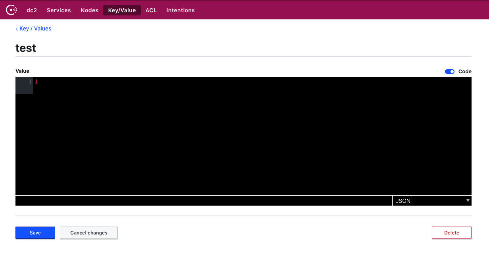

## This repo contains an example of consul-replicate in multi-dc. 

### More Information [HERE](https://github.com/hashicorp/consul-replicate)

#### The usage is pretty simple

- At least 3GB ram
- Virtualbox should be [installed](https://www.virtualbox.org/)
- Vagrant should be [installed](https://www.vagrantup.com/)
- Git should be [installed](https://git-scm.com/)

### Now we are ready to start, just follow the steps:

- Clone the repo
```
git clone https://github.com/chavo1/consul-replicate-example.git
cd consul-replicate-example
```
- Start the lab
```
vagrant up
```
#### Consul UI is available as follow:
##### DC1
- Server: https://192.168.56.51:8500 etc.
- Client: https://192.168.56.61:8500 etc.
##### DC2
- Server: https://192.168.57.51:8500 etc.
- Client: https://192.168.57.61:8500 etc.

#### Create an entry in your KV store on a Second DC "http://192.168.57.51:8500" - for example "test" with value "1":



#### From command line - ssh to the DC1
```
$ vagrant ssh consul-dc1-server01
$ sudo su -
$ consul-replicate -log-level trace -prefix "test@dc2"
```
- The last command will start consul-replicate and will replicate "test" entry from DC2 to DC1.
- Any additionally added or updated key/value in DC2 will be automatically replicated to DC1
```
2019/09/09 13:54:48.419229 [INFO] (runner) replicated 1 updates, 0 deletes
2019/09/09 13:55:41.959445 [TRACE] kv.list(test@dc2): returned 4 pairs
2019/09/09 13:55:41.959464 [TRACE] (view) kv.list(test@dc2) marking successful data response
2019/09/09 13:55:41.959485 [TRACE] view kv.list(test@dc2) successful contact, resetting retries
2019/09/09 13:55:41.959489 [TRACE] (view) kv.list(test@dc2) received data
2019/09/09 13:55:41.959513 [TRACE] (view) kv.list(test@dc2) starting fetch
2019/09/09 13:55:41.959529 [TRACE] kv.list(test@dc2): GET /v1/kv/test?dc=dc2&index=125&stale=true&wait=1m0s
2019/09/09 13:55:41.959613 [INFO] (runner) running
2019/09/09 13:55:41.969237 [DEBUG] (runner) skipping because "test" is already replicated
2019/09/09 13:55:41.969252 [DEBUG] (runner) skipping because "test1" is already replicated
2019/09/09 13:55:41.969255 [DEBUG] (runner) skipping because "test2" is already replicated
2019/09/09 13:55:41.978585 [DEBUG] (runner) updated key "test3"
2019/09/09 13:55:41.990496 [INFO] (runner) replicated 1 updates, 0 deletes
```

#### Do not forget to destroy the environment.
```
vagrant destroy
```
